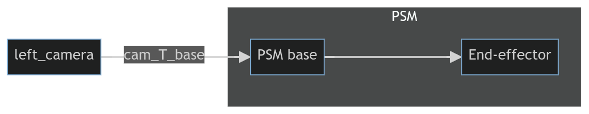

# Camera registration from SUJ

The transformation between the PSM base and the camera frame is required to teleoperate the Real and virtual PSM. This transform can be calculated with the dvrk-camera-registration script. Alternatively, the transformation can be approximated from SUJ measurements. Results won't be as accurate but it can be use for debugging purposes.



## Approximate camera registration from SUJ measurements

To generate the transformation from SUJ measurements, turn on the robot and run the script [approximate_camera_reg_with_SUJ.py](../scripts/testing_scripts/approximate_camera_reg_with_SUJ.py)

Copy the transformation matrix in Opencv convention into the json file template below. This generated json file can then be used to run the teleoperation scripts. 

```json
{
"base-frame": {"reference-frame": "/left_frame", 
               "transform": [[-0.351052,-0.440070,-0.826499,-0.011425],
                             [-0.276643, 0.892018,-0.357453,-0.048504],
                             [ 0.894556, 0.103161,-0.434888, 0.065096],
                             [ 0.000000, 0.000000, 0.000000, 1.000000]]}
}
```